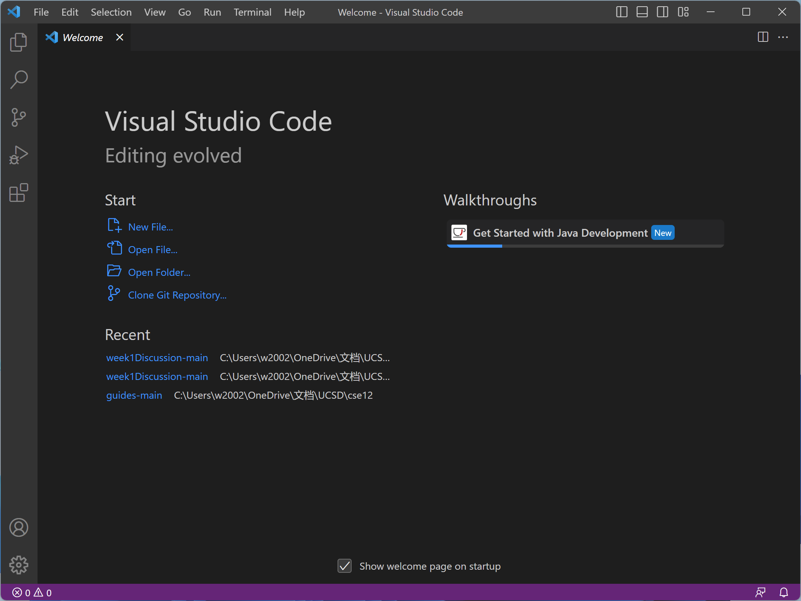
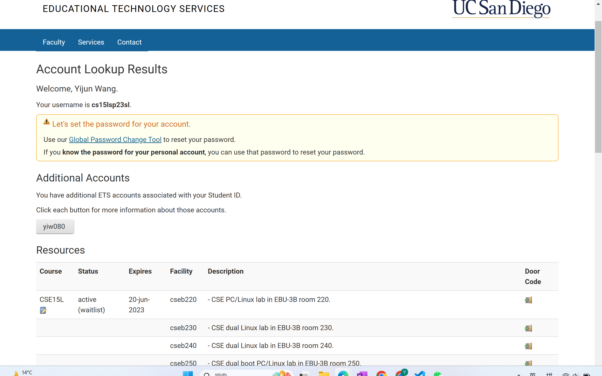
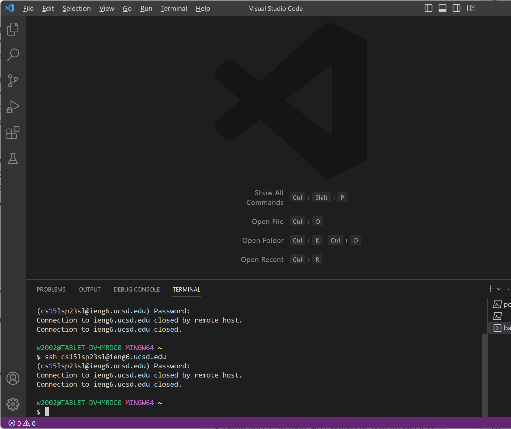
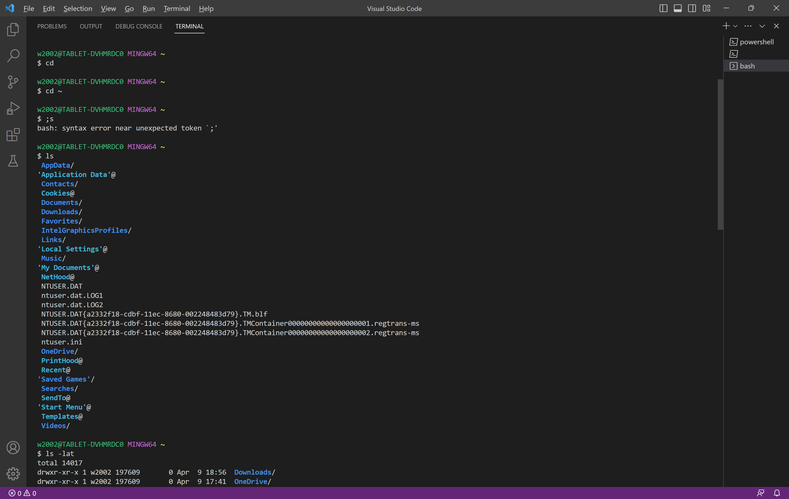
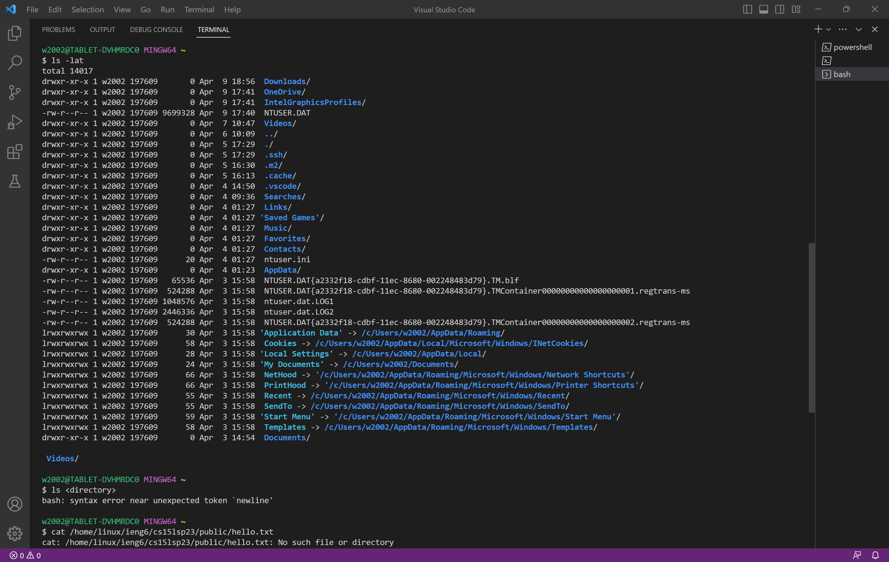

# cse 15l Lab report 1
---
1.Installing VScode
---

Installing the VScode did't take too much effort since I already have it on the computer.

2.Remotely Connecting
---

I first follow the instruction and reset the passwords, that isn't took too much time. But the reomote connection does not work out for me. I did reset the passwords, but when I type the password to log in, it just close the pathway. Might because I am still on the waitlist.

3.Trying Some Commands
---

Since the remote login didn't work out, some of the command does not gives output wantted. But it indeed shows some local file pathway on the computer.
